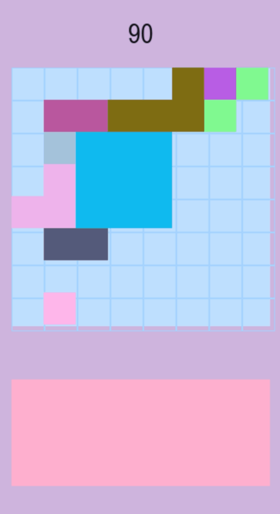

# AI for that one Block Game

I have a hard time accepting that I’m not good at some games. It really grinds my gears. That’s why I no longer play Monopoly and why I decided it was better for humanity if I uninstalled the chess app. But there’s this one block game - so simple, yet my performance, embarrassingly bad. Not terrible… just worse than my friends. So, I decided to fix that.

I replicated it in PyGame and built a simple AI for it. And now I feel smart again. So let's go through it.

It should be said (for legal purposes?) that this experiment was conducted for educational purposes only (induced by dissatisfaction with one’s own ineptitudes).

## The Game

As I said, this game is simple. There is a board, and each round, the player must place three random pieces on the board. When a line (vertical or horizontal) is made by placing a piece, that line is cleared, and the player gets points. Continuously clearing lines grants a point multiplier. 

Therefore, the goal is to always be able to place the provided pieces on the board and achieve the highest score.

## The Game Code

The `Game` class handles all game information: the board, the pieces for each round, and the core game logic. This includes calculating scores and determining whether the game is over.

The state pattern is used to control functionality at different points in the game. There are five different states:

- **Generating Pieces**: Where the pieces are generated and displayed.
- **Game Logic**: Checks if the game is over and if the round is over.
- **Board Logic**: Checks if the board has lines, clears them, and calculates the score.
- **Playing**: Waits for the player’s or AI’s placement of a piece.
- **Game Over**: For when the game ends.

The `Game` class is a publisher, sending a message anytime the game variables (e.g., the pieces, the board configuration) are changed. The UI is an observer class that updates when notified of these changes.

All moving parts are updated in the game loop: the game, UI, and AI, using the `update` method.

## The AI

The AI is a basic game tree. I thought about using Reinforcement Learning (RL), but the action space is too large, and there are clear rules and heuristics that can be implemented for a good AI.

When the pieces of the round are defined, a game tree is created with all the possible sequences of piece placements on the board. Each node stores helpful information for the AI, such as:

- The piece that was placed
- The position where it was placed
- The board after the piece was placed
- The resulting score, etc.

### Solution #1

To find the best sequence of moves, we can simply traverse the tree, find the leaf nodes, and keep track of the best game score encountered so far. After evaluating all leaf nodes, we are left with the leaf with the highest score. From it, we can retrieve the sequence of piece placements that led to that score and play it.

This works, but maximizing score is not always the best move—the board ended up very messy.

### Solution #2

**Heuristics!**  

In addition to the **score**, there are two more factors we can consider:

1. **Empty Squares**: Aim to maximize the number of empty squares on the board.
2. **Dispersion**: Control and minimize dispersion on the board by aggregating empty and occupied cells.

We can combine all 3 factors using min-max normalization for each and then weighting their importance. This made a much better AI.

<!--  -->

## Conclusion

In the end, the AI is pretty good. I'm both delighted and ashamed to say it's better than me. 

All in all, this was a cool project. By turning a personal frustration into a learning opportunity I became familiar with PyGame’s methods and game loop. When I eventually implement a Reinforcement Learning agent, my experience with PyGame will make the process much easier.

I also brushed up on my game tree and AI heuristic skills.

### Challenges

The bigger and emptier the board, the larger the action tree. If there are many possible plays, the search space grows exponentially. To handle this, I made the AI play randomly when the board had many open squares. However, this could also be improved by:

- Implementing a search time lime;
- Implementing parallel tree search.
